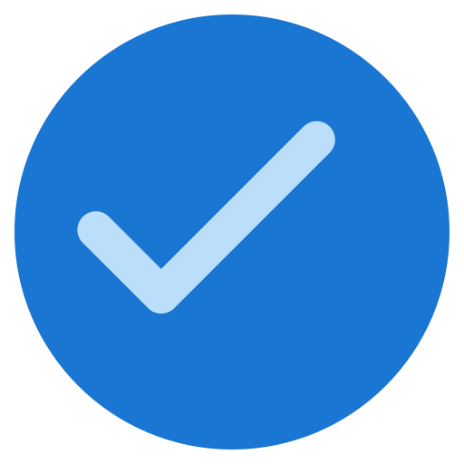
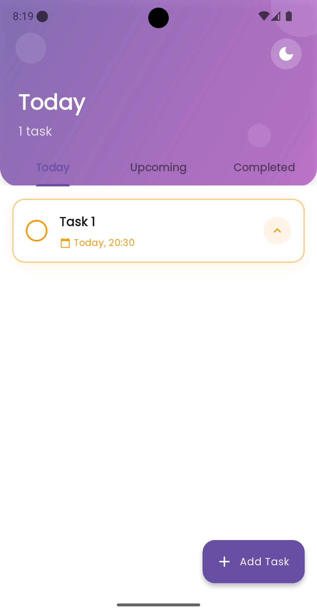
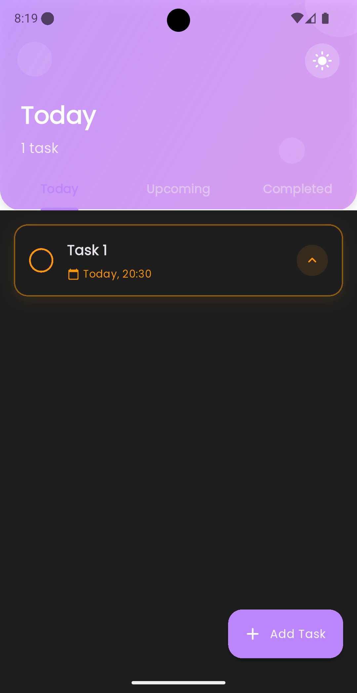
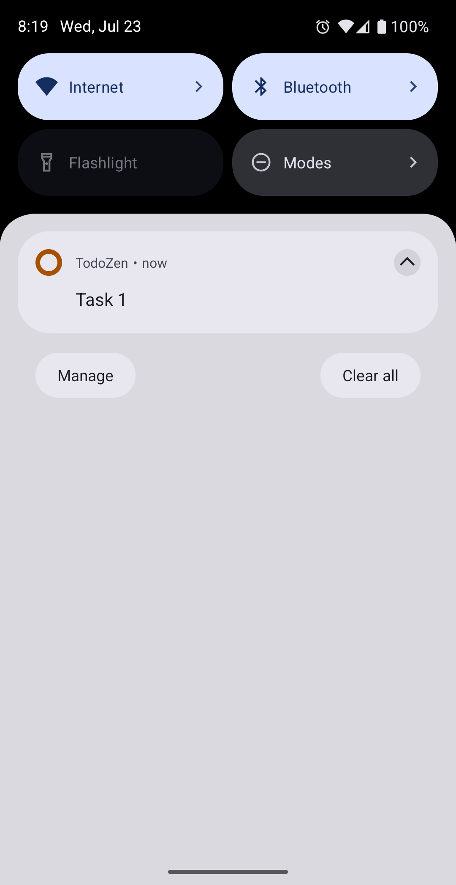

# TodoZen - Modern Task Management App

<p align="center">
  
</p>

## 📱 Overview

TodoZen is a beautifully designed, feature-rich task management application built with Flutter. It helps users organize their daily tasks with an intuitive interface, timely notifications, and a clean, modern design following Material 3 guidelines.

## ✨ Features

- **Beautiful Material 3 Design**: Clean, modern UI with smooth animations and transitions
- **Task Management**: Create, edit, delete, and mark tasks as complete
- **Task Categorization**: Organize tasks by Today, Upcoming, and Completed
- **Priority Levels**: Set Low, Medium, or High priority for tasks
- **Due Date & Time**: Schedule tasks with specific dates and times
- **Smart Notifications**: Get reminders 30 minutes and 10 minutes before task due time
- **Dark/Light Theme**: Toggle between light and dark themes
- **Persistent Storage**: Tasks are saved locally using SharedPreferences
- **Animated UI**: Engaging animations for a delightful user experience
- **Precise Alarms**: Uses Android's exact alarm permission for timely notifications

## 🏗️ Architecture

TodoZen follows a clean architecture approach with Provider for state management:

- **Models**: Data structures for tasks and their properties
- **Providers**: State management using the Provider pattern
- **Services**: Notification handling and other core services
- **Screens**: UI components for different app screens
- **Widgets**: Reusable UI components

## 📦 Dependencies

- **flutter**: Core framework
- **provider**: State management
- **shared_preferences**: Local storage
- **intl**: Date formatting
- **uuid**: Unique ID generation
- **google_fonts**: Custom typography
- **flutter_animate**: UI animations
- **flutter_staggered_animations**: List animations
- **awesome_notifications**: Rich notification system

## 🚀 Getting Started

### Prerequisites

- Flutter SDK (latest stable version)
- Android Studio / VS Code
- Android SDK / Xcode (for iOS development)

### Installation

1. Clone the repository
   ```bash
   git clone https://github.com/yourusername/todozen.git
   ```

2. Navigate to the project directory
   ```bash
   cd todozen
   ```

3. Install dependencies
   ```bash
   flutter pub get
   ```

4. Run the app
   ```bash
   flutter run
   ```

## 📱 App Structure

```
lib/
├── app/                  # App configuration
│   ├── theme.dart        # Theme configuration
│   └── todo_app.dart     # App entry point
├── models/               # Data models
│   └── todo.dart         # Todo model
├── providers/            # State management
│   └── todo_provider.dart # Todo state provider
├── screens/              # App screens
│   ├── edit_task_screen.dart
│   ├── splash_screen.dart
│   ├── task_details_screen.dart
│   └── todo_screen.dart
├── services/             # Business logic
│   ├── notification_helper.dart
│   └── notification_service.dart
├── widgets/              # Reusable UI components
│   ├── add_task_bottom_sheet.dart
│   └── custom_sliver_app_bar.dart
└── main.dart             # Entry point
```

## 🔔 Notification System

TodoZen uses the Awesome Notifications package to provide rich, interactive notifications:

- Task reminders 30 minutes before due time
- Final reminders 10 minutes before due time
- Support for Android's exact alarm permission for precise timing
- Interactive notification actions

## 🎨 UI/UX Features

- Animated splash screen
- Staggered animations for task lists
- Custom sliver app bar with dynamic content
- Smooth transitions between screens
- Intuitive task creation and editing interfaces
- Responsive design that works on various screen sizes

## 📸 Screenshots

<p align="center">
  
  
  
</p>

## 📝 License

This project is licensed under the MIT License - see the [LICENSE](LICENSE) file for details.

Copyright (c) 2023 TodoZen

## 🙏 Acknowledgements

- Flutter team for the amazing framework
- All the package authors that made this app possible

---

<p align="center">Made with ❤️ as part of the 100 Days of Flutter Challenge</p>